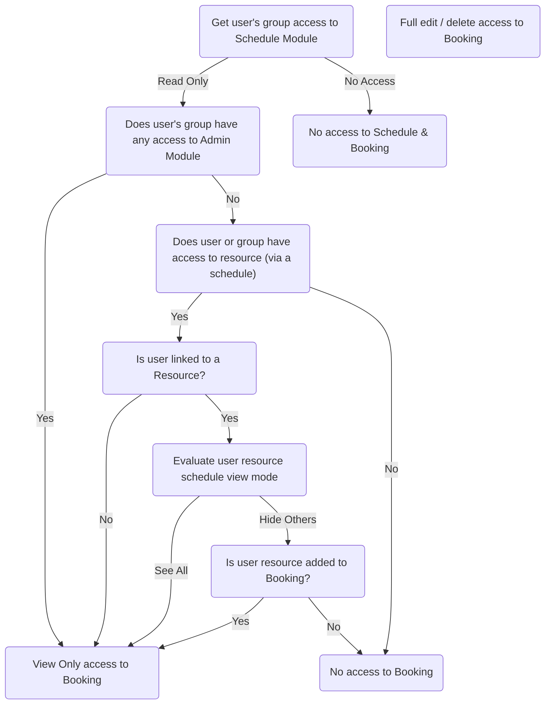

## Properties

Bookings always include a **name**, a **start date-time** and an **end date-time**. Additionally, bookings may include any of the following properties:

<CardGroup cols={2}>
    <Card title="Resources & Rates" icon="camera">
        Supports one or multiple resources. Buy & sell rates can be set for each resource
    </Card>
    <Card title="Time Entries" icon="timer">
        Any time entries that were logged by resources directly to the booking
    </Card>
    <Card title="Project" icon="folder-closed">
        Used for project reporting and sets the client and client contact fields
    </Card>
    <Card title="Client & Contact Person" icon="book-user">
        Pulls through client contact info and used to prefill quotes / invoices
    </Card>
    <Card title="Billable Items" icon="utensils">
        Adhoc items with buy & sell costs that are added to prefilled quotes / invoices
    </Card>
    <Card title="Quotes & Invoices" icon="file-invoice">
        Details about the linked quotes & invoices generated from bookings
    </Card>
    <Card title="File Attachments" icon="paperclip">
        Files that are related to this booking can be uploaded and attached directly
    </Card>
    <Card title="Custom Fields" icon="i-cursor">
        Single, multi line and select menu input fields can be added to bookings
    </Card>
</CardGroup>

## Access Permissions

The ability to view, create, edit and delete a booking is derived from the combination of group, schedule and individual booking permissions.

To view a booking, a user must have Read access to the Schedule Module and Read access to at least one Schedule.

Depending on the resources allocated to a schedule, the user will be able to view any booking that is associated with those resources.

## Creating a booking

<Check>
    ### Permissions
    To create a booking, a user must be in a User Group with Read & Write privileges to the Schedule Module.
</Check>

